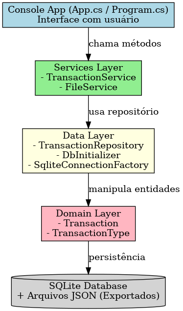
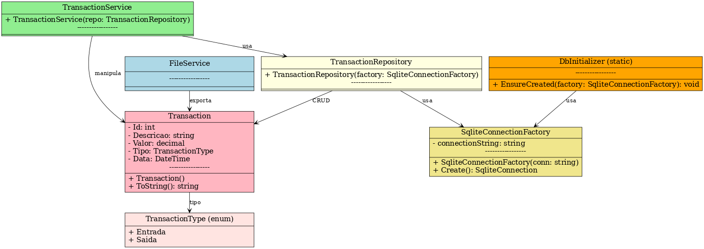

# 💜 Nexora – Mini Central Financeira (C#)

## 📖 Sobre a Nexora
A **Nexora** nasceu como uma proposta inovadora no **Challenge XP Investimentos (FIAP)**, com o objetivo de transformar a experiência do investidor moderno.  
Nossa visão é **democratizar a educação financeira**, aliando **inteligência artificial, personalização e design acessível**, sempre colocando o usuário no centro da experiência.

A proposta original contempla:
- 📊 **Central de controle financeiro**: acompanhamento de gastos, receitas e metas  
- 🤖 **Aurora**: uma assistente virtual humanizada de educação e orientação financeira  
- 🎮 **Educação financeira gamificada**: quizzes, simuladores e conteúdo acessível  
- 🔐 **Segurança e privacidade**: seguindo LGPD e boas práticas de Open Finance  

---

## 💻 Projeto em C# – Mini Central Financeira

Este repositório traz uma **versão simplificada da Nexora**, implementada em **C#**.  
Aqui, focamos apenas na **Central de Controle Financeiro**, com as seguintes metas acadêmicas:

- Estruturação de classes e código limpo  
- Manipulação de arquivos (JSON)  
- Conexão com banco de dados (SQLite)  
- CRUD completo  
- Interface em Console  

> ⚠️ Importante: recursos como **Aurora (IA)** e **gamificação** fazem parte da **proposta original**, mas **não estão implementados** neste projeto em C#.  

---

## 📐 Diagramas do Projeto

### Arquitetura em Camadas


### Diagrama de Classes


---

## ⚙️ Funcionalidades Implementadas

### 1. Gerenciamento de Transações
- ➕ **Adicionar transação** (Entrada ou Saída, com valor, descrição e data)  
- 📋 **Listar transações** em ordem decrescente (mais recentes primeiro)  
- ✏️ **Editar transação existente** (alterar descrição, valor, tipo e/ou data)  
- ❌ **Excluir transação** (com validação de ID e listagem antes de excluir)  
- 💰 **Resumo (saldo atual)** → soma das entradas menos saídas  

### 2. Exportar Extrato
- 📤 **Baixar extrato em JSON**: o usuário escolhe o local onde salvar o arquivo gerado.

---

## 🗄️ Arquitetura do Projeto

```plaintext
Nexora.Finance/
└─ Nexora.Finance.CLI/
   ├─ Program.cs                 # ponto de entrada
   ├─ App.cs                     # menu e fluxo principal
   ├─ Domain/                    # modelos de dados
   │  ├─ Transaction.cs
   │  └─ TransactionType.cs
   ├─ Data/                      # acesso ao banco SQLite
   │  ├─ SqliteConnectionFactory.cs
   │  ├─ DbInitializer.cs
   │  └─ TransactionRepository.cs
   ├─ Services/                  # regras de negócio e arquivos
   │  ├─ TransactionService.cs
   │  └─ FileService.cs
   └─ DataStore/                 # banco e arquivos gerados
```

## 🛠️ Tecnologias Utilizadas

- **C# 12 / .NET 8**  
- **SQLite** (via Microsoft.Data.Sqlite)  
- **System.Text.Json** (serialização JSON)  
- **Console App no Visual Studio 2022**  

---

## 🚀 Como Executar

1. Clone o repositório "git clone https://github.com/seu-usuario/nexora-finance.git"
2. Abra no Visual Studio 2022  
3. Restaure os pacotes NuGet  
4. Compile e execute (**F5** ou **Ctrl+F5**)  

> Na primeira execução, será criado automaticamente o banco `nexora.db` dentro da pasta **DataStore**.

---

## 📌 Observações

- A exportação em **JSON** permite ao usuário escolher o local de salvamento.  
- O projeto foca na didática de **CRUD + Arquivos + Banco de Dados**, mas mantém a essência da Nexora como plataforma de finanças.  

---
## 👨‍💻 Autores

Projeto desenvolvido pelos integrantes da Nexora (FIAP, 2025):
- Gabriel Machado Carrara Pimentel — RM99880
- Lourenzo Ramos - RM99951
- Letícia Resina — RM98069
- Vítor Hugo Rodrigues — RM97758
